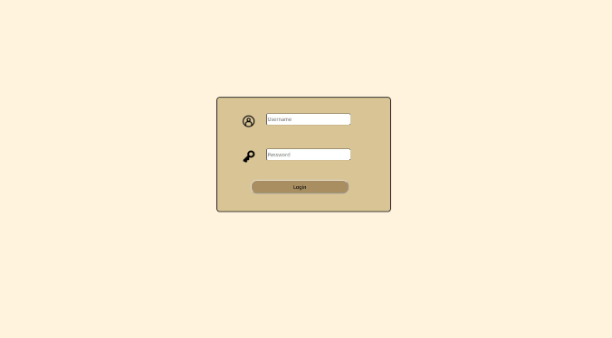
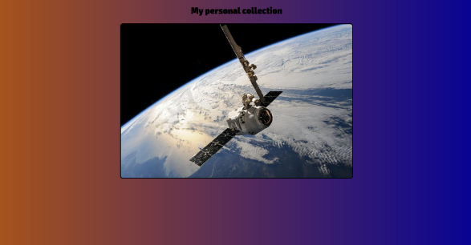
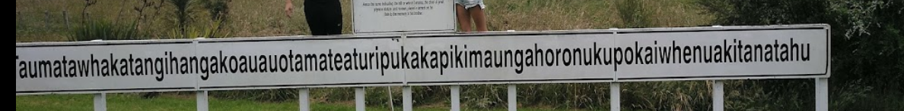
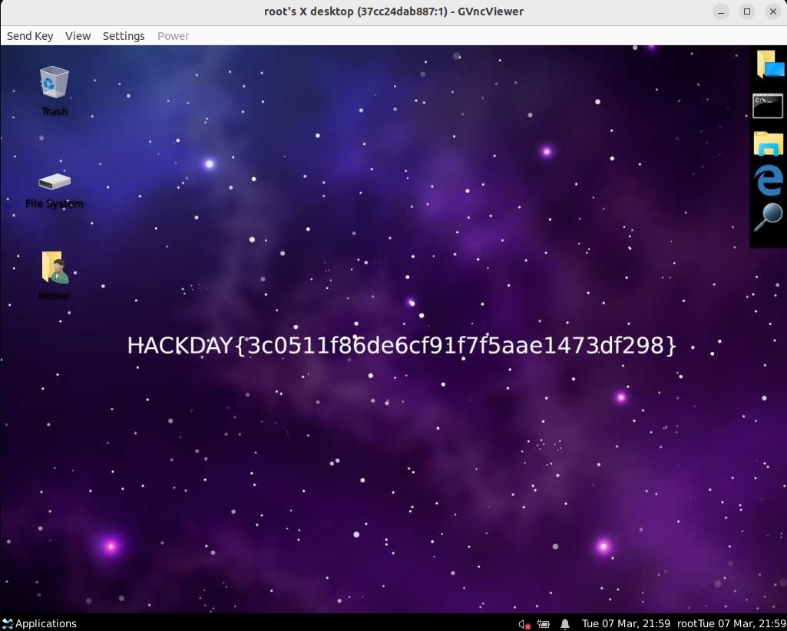

# Treasure hunt

## Information

**Authors :** couttcoutt & Francis <br>
**CTF :** HACKDAY <br>
**Date :** 16/03/2023

<br>

## Subject

> Before being executed for his crimes, the galactic pirate Gold D Adler reportedly said the words : “You want my treasure? You can have it! I left everything I gathered together in one place! Now you just have to find it!” With these words, a new page has appeared on his personal site. It’s up to you!
>
> https://7c21111516t.hackday.fr/
>
> The validation flag is like HACKDAY{1a79a4d60de6718e8e5b326e338ae533}

<br>

## Analysis

The site returns a login form.



First, we check the `robots.txt` for hidden path and files. We get:
```
/passwordSuggestionList.txt
```

and on https://7c21111516t.hackday.fr/passwordSuggestionList.txt we get a list of potential password :


``` 
family
jonathan
987654321
computer
estrella
whatever
dragon
vanessa
cookie
```

After trying some password on the login page, no result. So we decided to leave it on the side for now. We try to analyze the source code, requests and cookies, and we see that nothing suspicious appears. We are therefore oriented towards the injections.

<br>

## Exploitation

So we tried some injection. We've started with some basic SQLi. And against the odds, this payload has worked :

```
username: ' OR 1=1 -- / password : a
```

We arrive on a page with 31 pictures :



and a comment in the source code :

```html
<!--Note for the booty hunters: nice you're one step closer to my treasure !-->
<Did I ever tell you that I loved pictures? Those might be more important than what you think :p -->
```

Then download all the pictures :

```bash
couttcoutt@couttcoutt-PC:~$ wget -r --no-parent https://7c21111516t.hackday.fr/images/slides/
```

After running exiftools, and aperisolve, no information comes out of these images. So we decide, from the previous password list, to use the steganography tool steghide.

```py
import subprocess

image_dir = './' # dossier contenant les images sous la forme 001.png et O3O.png
wordlist_file = './wordlist2.txt' # liste pwd de /passwordSuggestionList.txt

for i in range(1, 31):
    if i < 10 :
        image_path = f'{image_dir}00{i}.jpg'
    else:
        image_path = f'{image_dir}0{i}.jpg'
    
    print('image ' + str(i))

    with open(wordlist_file, 'r') as f:
        for password in f:
            password = password.strip()  
            

            command = f'steghide extract -sf {image_path} -xf output_{i}.txt -p {password}'
            result = subprocess.run(command, shell=True, capture_output=True, text=True)
            
            
            if result.stderr == '':
                print(f'Image {i} déchiffrée avec le mot de passe {password}')
                break 
```

On the image 017.png you get this :

```
Hi swashbuckler, congratulations for coming this far ! 
You can have access to all my wealth in my bank account if you get connected 
to the server. The password is the first 8 letters of the 
name of the historical site where we buried the treasure.
Here are the GPS coordinates of the site.

- - - - - - - - - - - - - - - - - - -
-40.33892996,176.58696554    |
- - - - - - - - - - - - - - - - - - -
```
We test the coordinates on google maps and we get an image :

>Taumatawhakatangihangakoauauotamateaturipukakanuipikimaungapokaiwhenuakitanatahu 

So we get the first 8 characters of the query: `Taumataw`.

Then no more information, we test several potential endpoints, but nothing!
Finally, we are told that port scanning is allowed, so we use `nmap` :

```
couttcoutt@couttcoutt-PC:~$ nmap -p- 7c21111516t.hackday.fr

PORT STATE SERVICE
80/tcp open http
443/tcp open https
5901/tcp open vnc-1
12345/tcp open netbus
```

We see a VNC port, so we test with `vnc-viewer` on 7c21111516t.hackday.fr:59011. We are asked for a pwd. We enter : Taumataw and we get the flag :

